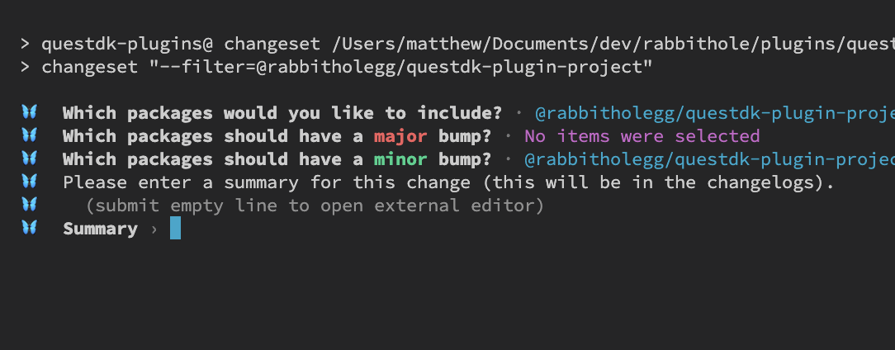

# Finishing Steps

### Implement `getSupportedTokens` function


This function is only applicable for ERC-20 token-based actions such as `swap`, `bridge` and `stake`. For other action types like `mint`, `vote` and `delegate`, you should just return an empty array.


This function is used to get info for ERC-20 tokens like decimals and icons so they can properly be displayed on the frontend. To implement `getSupportedTokens`, we will want to return a valid list of tokens for each supported chain. You can either map these token addresses yourself, or you can use or build off our default token mappings [`CHAIN_TO_TOKENS`](../core-concepts/utilities/constants.md#object-chain\_to\_tokens), which can be imported from `@rabbitholegg/questdk-plugin-utils`.&#x20;


```typescript
import { CHAIN_TO_TOKENS } from '@rabbitholegg/questdk-plugin-utils'

export const getSupportedTokenAddresses = async (
  _chainId: number,
): Promise<Address[]> => {
  // Given a specific chain we would expect this function to return a list of supported token addresses
  return CHAIN_TO_TOKENS[_chainId] ?? []
}
```


### Create README.md

This step is optional, but it is recommended to also include a readme. List some of the project details, any relevant documentation and anything else you think would provide useful context for reviewers.

### Generate Changeset

When all tests pass and you're satisfied with your plugin's functionality, it's time to generate a changeset for version tracking. A changeset documents modifications in a new version, maintaining a clear record for future reference and collaboration. To generate a changeset, simply run the changeset [command](../commands.md):&#x20;


```bash
pnpm changeset
```


Follow the instructions in the console. Give the registry and your projects package a minor bump and leave a description. Once you are finished, it should create a changeset file consisting of three random words (ie: `socks-boots-cloud.md`).  Commit this file and we can now submit our PR.

<figure><figcaption><p>After running the changeset command, follow the instructions in the terminal.</p></figcaption></figure>

### Plugin Details Configuration

Make sure the `plugin-details.yml` file is complete and contains the correct details for your project. This step is mandatory if you wish to submit a pull request for your plugin.&#x20;


```yaml
project:
  name: Balancer
  iconOption: https://assets.coingecko.com/coins/images/11683/large/Balancer.png
  appLink: https://balancer.fi/

tasks:
  - name: Swap on Balancer
    link: https://app.balancer.fi/swap # action-specific link
    iconOption: https://assets.coingecko.com/coins/images/11683/large/Balancer.png
    actionPluginId: swap
```


### Submit Pull Request&#x20;


Please adhere to [conventional commit guidelines](https://kapeli.com/cheat\_sheets/Conventional\_Commits.docset/Contents/Resources/Documents/index) for commit messages and pull request titles


Now that everything is complete, the last thing to do is to submit your plugin pull request to the [**questDk-Plugin repo**](https://github.com/rabbitholegg/questdk-plugins/pulls)**.** Once your PR has been accepted, you will be able to create boosts on boost terminal. When submitting a pull request, please try to include as much context as possible to expedite the review process. You can check out one of the previous [pull requests ](https://github.com/rabbitholegg/questdk-plugins/pull/162)to get a feel for how it should be structured.
