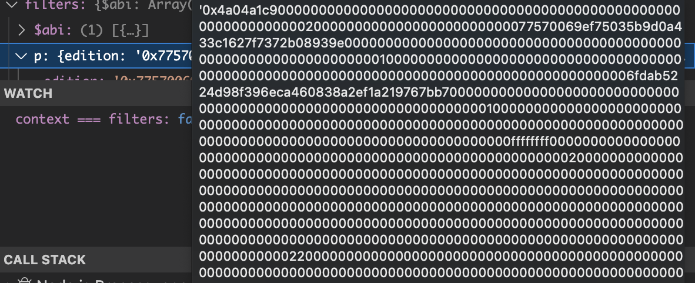
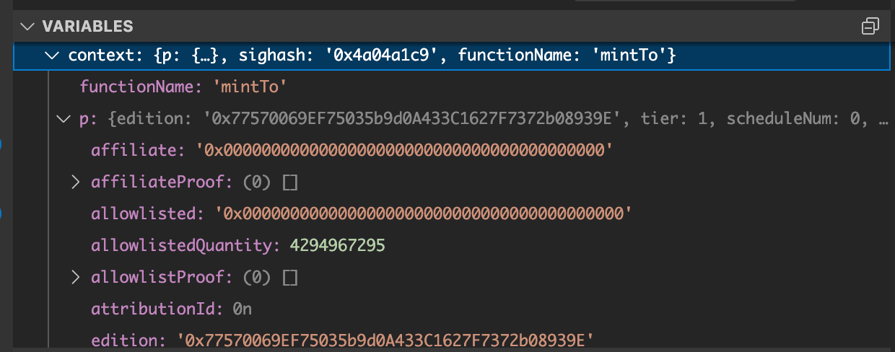
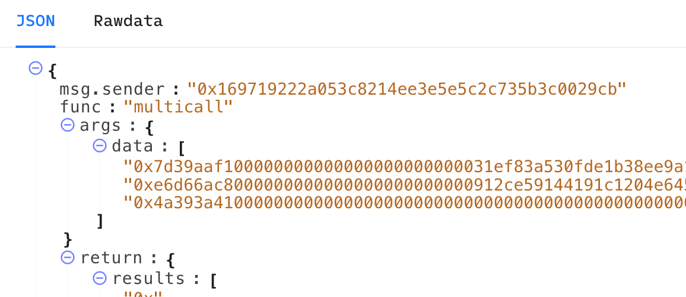
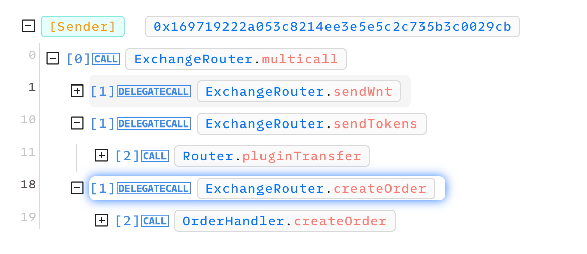
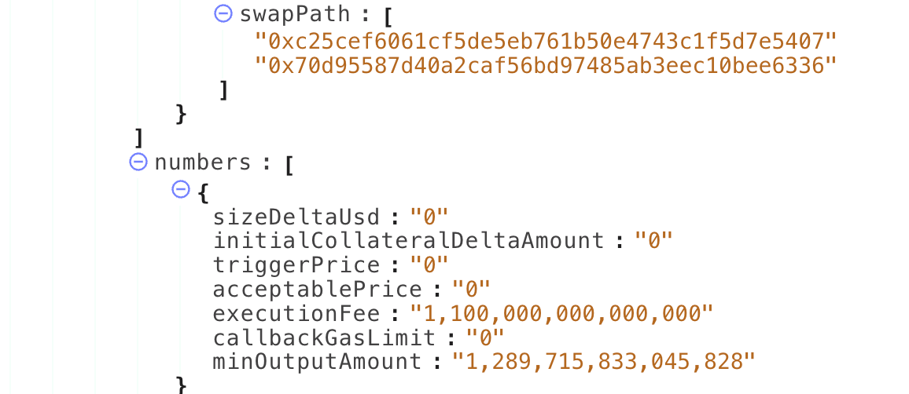
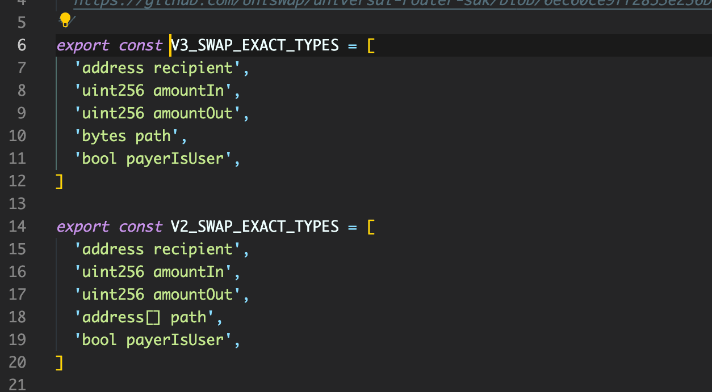
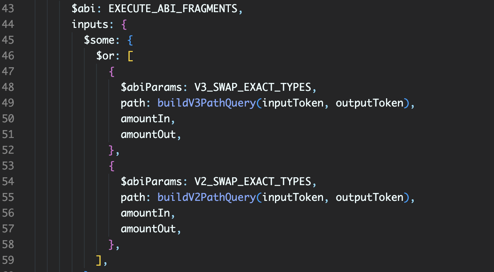

# ABI Decoding

The ABI decoding operators in QuestDK Plugins are essential for interpreting smart contract interactions from raw input data. Using one of the abi operators alongside the ABI of a specific contract function, we are able to decode the raw input data into a human-readable format. This allows us to accurately determine whether specific on-chain actions have been completed.

### `$abi` Operator

**Purpose**: The `$abi` operator is used to decode raw input data into human-readable parameters. The decoded inputs can then be compared against our standard [`ActionParams`](https://github.com/rabbitholegg/questdk/blob/main/src/actions/types.ts#L73).

**Usage**: `$abi` will be the most common ABI decoding operator that will be used. It works by parsing the function signature at the very start of the input calldata and matches it with the provided contract abi.

**Example:**  In the given example from the Sound.xyz Mint Plugin, the [`SUPERMINTER_ABI`](https://github.com/rabbitholegg/questdk-plugins/blob/main/packages/soundxyz/src/constants.ts#L3) is utilized with the `$abi` operator to interpret the inputs of the `mintTo` function from the Sound.xyz [superminter](https://optimistic.etherscan.io/address/0x0000000000cf4558c36229ac0026ee16d3ae35cd) contract. Below we are matching the [`MintActionParams`](https://github.com/rabbitholegg/questdk/blob/main/src/actions/types.ts#L44) with the inputs of the `mintTo` function.


```javascript
{
  input: {
    $abi: SUPERMINTER_ABI,
    p: {
      edition: contractAddress,
      quantity: amount,
      to: recipient,
    },
  },
}
```


<div>

<figure><figcaption><p>Raw calldata before being decoded. </p></figcaption></figure>

 

<figure><figcaption><p>Calldata is decoded, we can now see the inputs for the <code>mintTo</code> function.</p></figcaption></figure>

</div>

***

### `$abiAbstract` Operator

**Purpose**: The `$abiAbstract` operator is very similar to the `$abi` operator with the clear distinction that it searches for function signatures throughout the entire calldata, instead of just at the beginning.

**Usage**: The `$abiAbstract` operator is primarily used in scenarios involving nested or secondary contract calls. It's ideal for cases where you need to decode and analyze inputs that are part of sub-calls within a larger transaction, such as multicalls.

**Example:**  The following example is from GMX, which uses a multicall transaction. There is not much we can use from the data in the inputs of the multicall without more decoding. This is where the `$abiAbstract` operator comes in, as it is able to skip over the multicall signature and look for the specific [`createOrder`](https://github.com/rabbitholegg/questdk-plugins/blob/main/packages/gmx/src/abi.ts#L149) function signature. We can then match the `OptionsActionParams` with the inputs of the `createOrder` function.

<div>

<figure><figcaption><p>A multicall transaction containing inputs for a trade on GMX</p></figcaption></figure>

 

<figure><figcaption><p>We want to target <code>createOrder</code> within the calldata to get the proper params</p></figcaption></figure>

 

<figure><figcaption><p>The inputs for <code>createOrder</code> can be matched with the <code>OptionsActionParams</code></p></figcaption></figure>

</div>


```typescript
{
  $abiAbstract: GMX_SWAPV2_ABI,
  params: {
    numbers: {
      minOutputAmount: amountOut,
    },
    orderType: { $lte: OrderType.LimitSwap },
    addresses: {
      initialCollateralToken: ETH_USED ? Tokens.WETH : tokenIn,
      receiver: recipient,
      swapPath: {
        $last: getMarketAddress(
          ETH_USED ? Tokens.WETH : tokenIn,
          tokenOut,
        ),
      },
  },
}
```


***

### `$abiParams` Operator

**Purpose**:  The `$abiParams` operator is useful for situations where there is some nested calldata, but there is no contract abi available to decode it.

**Usage**:  You use this operator the same way you would use the other abi operators, except it takes in an array of abi params, instead of a contract abi.

**Example:**  In the following example from Uniswap, there is nested calldata inside of the `bytes` array within the input data. There is no contract abi available to decode this calldata. To decode, we create an array of parameters based on [what we expect to decode within the nested calldata](https://github.com/Uniswap/universal-router-sdk/blob/6ec60ce9ff2853e236ba8f40a3aaa8819a97bd8b/src/utils/routerCommands.ts#L74) and use this as the value for the `$abiParams` operator.

<div>

<figure><figcaption><p>array of abi params which should match the calldata we are wanting to decode. </p></figcaption></figure>

 

<figure><figcaption><p>usage is very similar to the $abi operator</p></figcaption></figure>

</div>
