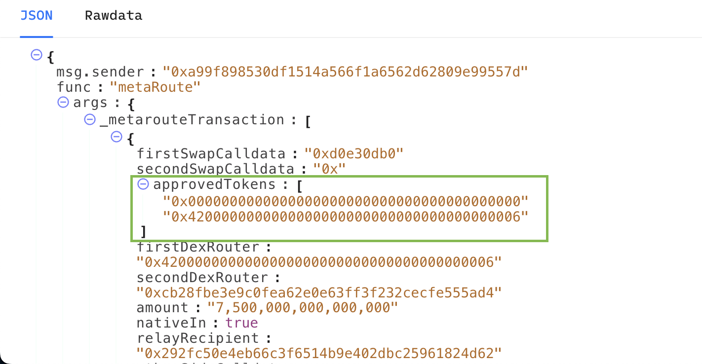

# Array Operators

### `$first` Operator <a href="#and-operator" id="and-operator"></a>

**Purpose**: Used for applying filter conditions to the first element in an array. This is particularly useful in scenarios where the initial element holds a key piece of data that needs to be separated from the rest of the array.

**Usage**: Use in situations where you need to target the first item in an array.

**Example**: In this example from Symbiosis, we are checking that the **first** element in the `approvedTokens` array matches the `tokenIn` parameter passed into the `swap` function.


```javascript
{
  $abi: metaRouteABI,
  _metarouteTransaction: {
    approvedTokens: { $first: tokenIn },
  },
}
```


<figure><figcaption><p>Use the <code>$first</code> operator to target the first item in the approvedTokens array. The <code>$last</code> operator targets the final item in the array.</p></figcaption></figure>

### `$last` Operator <a href="#and-operator" id="and-operator"></a>

**Purpose**: Similar to the `$first` operator , `$last` is used for applying filter conditions to the last element in an array.&#x20;

**Usage**: Use in situations where you need to target the final item in an array.

**Example**: Using the same example from Symbiosis, this is how we would check that the **last** element in the `approvedTokens` array matches the `tokenOut` parameter


```javascript
{
  $abi: metaRouteABI,
  _metarouteTransaction: {
    approvedTokens: { $last: tokenOut },
  },
}
```


### `$some` Operator <a href="#and-operator" id="and-operator"></a>

**Purpose**: The `$some` operator checks if **any** element in an array meets a specified condition. It's useful when the position of the element is not important, but its presence is.

**Usage**: This operator is ideal in situations where you need to verify the presence of a specific parameter within an array, regardless of where it appears in the sequence.

**Example**: In this example from the Zora plugin, the `$some` operator is used to make sure that the `contractAddress` appears anywhere in the `_targets` array. Batch mints are possible on Zora, which makes it possible to mint several different tokens in one transaction.&#x20;


```javascript
{
  $abiAbstract: UNIVERSAL_MINTER_ABI,
  _targets: {
    $some: contractAddress,
  },
}
```


### $nth Operator

**Purpose**: The `$nth` operator checks if the element in the `nth` position of an array meets a specified condition. It allows you to target a parameter at a specific index within an array.

**Usage**: This operator is ideal in situations where you need to verify the presence of a specific parameter within an array at a certain index.

**Example**: In this example from the Vela plugin, the `$nth` operator is used to verify the item at index 2 in the `_params` array is >= `amount`.

<pre class="language-javascript"><code class="lang-javascript">{
  $abi: TPSL_ORDER_ABI,
<strong>  _params: { $nth: { index: 2, value: GreaterThanOrEqual(amount) } }
</strong>},
</code></pre>

```typescript
type NthFilter = {
  index: bigint | number | string
  value: TransactionFilter | FilterObject
}
```
