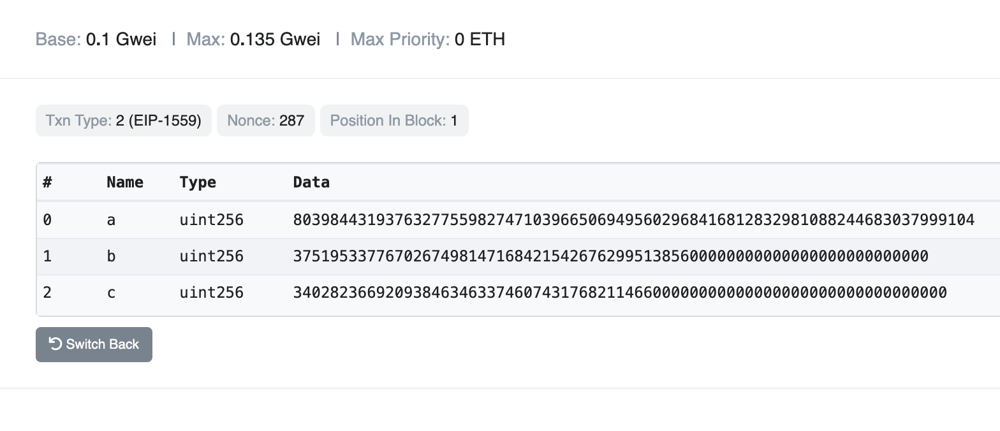
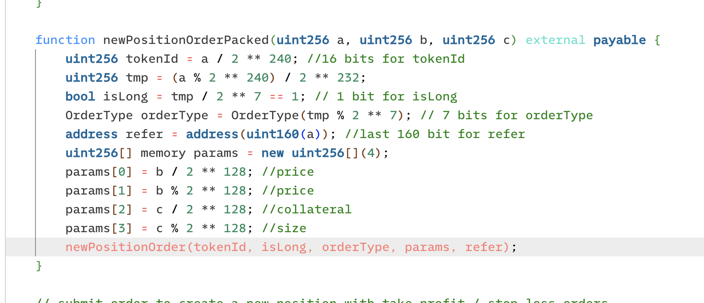
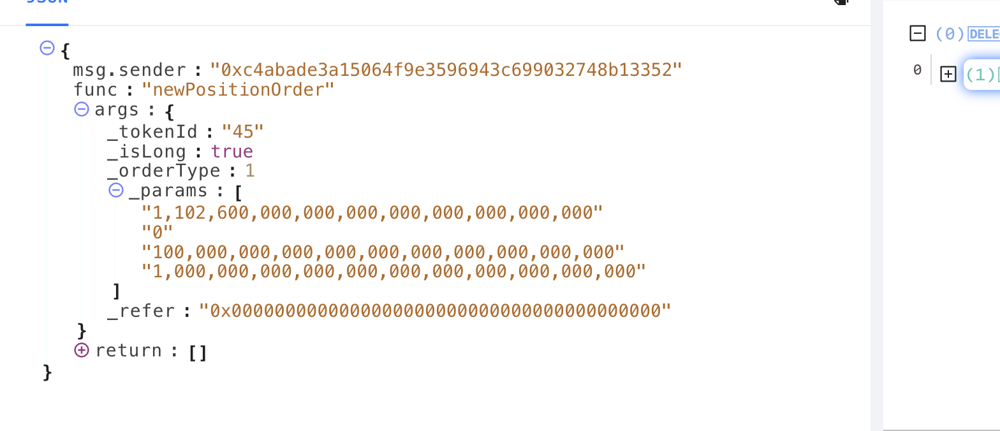

# Bitmask Operator

### $bitmask

**Purpose**: The `$bitmask` operator is used in situations where multiple values are combined or packed into a single parameter. The bitmask is applied to the parameter, isolating specific bits. You then compare these isolated bits against a provided value to determine if they match certain criteria.

**Usage**: The `$bitmask` operator is utilized by inputting a bitmask value (which can be in hexadecimal, decimal, or binary form) and a numerical operator for filtering. This operator applies the bitmask to the transaction input, isolating specific bits based on the bitmask value. It then compares these isolated bits to the provided value, returning a boolean result based on whether the comparison meets the specified condition.

**Example:** In the following example from the Vela plugin, the values we need are packed into the inputs `a`, `b`, and `c`. In order to decode these packed values, we must apply bitmasks to isolate the specific bits that contain the values we need. Once the values are isolated they can then be compared to our standard `ActionParams`. For example, to find the `tokenId` we need to isolate the first 16 bits of `a`. (see images below)

```typescript
type BitmaskFilter = {
  bitmask: bigint | number | string
  value: bigint | number | string | NumericOperator
}
```


```typescript
export function getTokenPacked(
  token: Address | undefined,
): { $bitmask: BitmaskFilter } | undefined {
  if (!token) return undefined
  const tokenId = TOKEN_TO_ID[token.toLowerCase()]
  if (!tokenId) {
    throw new Error('No tokenId found for the provided token address')
  }
  return {
    $bitmask: {
      bitmask:
        '0xFFFF000000000000000000000000000000000000000000000000000000000000',
      value: tokenId << 240n,
    },
  }
}
```


The `$bitmask` operator extracts the first 16 bits of the packed value, which is then used compared with the `tokenId`. By shifting the `tokenId` 240 places to the left, it aligns with the leading bits of the packed value, enabling a direct comparison.

<div>

<figure><figcaption><p>Values like amount, token and ordertype are packed into these values.</p></figcaption></figure>

 

<figure><figcaption><p>You will need to figure out how the parameters are packed. Look for hints in the projects code.</p></figcaption></figure>

 

<figure><figcaption><p>The unpacked values we will be targeting</p></figcaption></figure>

</div>
