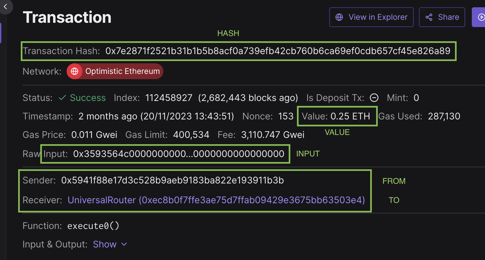

# Helpers

## type `TestParams<T>`

[**View on Github**](https://github.com/rabbitholegg/questdk-plugins/blob/fd797855c78239c1197145a2fb50fa9ceb648e43/packages/utils/src/helpers/test-helpers.ts#L20)

**Purpose**: `TestParams` is a generic type used to define the structure for testing plugins. It encapsulates a transaction object along with a set of [`ActionParams`](https://github.com/rabbitholegg/questdk/blob/main/src/actions/types.ts#L73) specific to the action being tested.

**Structure:**

* `transaction`: [`Transaction`](https://github.com/rabbitholegg/questdk-plugins/blob/fd797855c78239c1197145a2fb50fa9ceb648e43/packages/utils/src/helpers/test-helpers.ts#L5) - An object containing transaction details.&#x20;
* `params`: [`ActionParams`](https://github.com/rabbitholegg/questdk/blob/main/src/actions/types.ts#L73) - The specific parameters for the action being tested. The specific parameters that will be needed are based on the ActionParams that are passed in (ie: SwapActionParams, BridgeActionParams, Etc.)

**Example:** In the example below, we are grabbing the transaction details from [**tenderly**](https://dashboard.tenderly.co/tx/optimistic/0x7e2871f2521b31b1b5b8acf0a739efb42cb760b6ca69ef0cdb657cf45e826a89) and using them as the values for the transaction object. Once the transaction details have been pasted in, add the parameters `params` object containing the specific criteria that you will want to test the transaction against. Once you have setup some `TestParams` objects, you will be able to use them along with the `createTestCases` function to quickly generate test cases for your plugin.

<figure><figcaption><p>Tenderly is the best way to quickly grab the important details from a transaction. </p></figcaption></figure>


```typescript
import type { SwapActionParams } from '@rabbitholegg/questdk'
import { type TestParams, Chains } from '@rabbitholegg/questdk-plugin-utils'
import { parseEther, parseUnits, zeroAddress } from 'viem'

export const V3_NATIVE_TO_TOKENS: TestParams<SwapActionParams> = {
  transaction: {
    chainId: Chains.OPTIMISM,
    to: '0xec8b0f7ffe3ae75d7ffab09429e3675bb63503e4',
    from: '0x5941f88e17d3c528b9aeb9183ba822e193911b3b',
    hash: '0x7e2871f2521b31b1b5b8acf0a739efb42cb760b6ca69ef0cdb657cf45e826a89',
    input:
      '0x3593564c000000000000000000000000000000000000000000000000000000000000006000000000000000000000000000000000000000000000000000000000000000a000000000000000000000000000000000000000000000000000000000655bd42b00000000000000000000000000000000000000000000000000000000000000020b000000000000000000000000000000000000000000000000000000000000000000000000000000000000000000000000000000000000000000000000000002000000000000000000000000000000000000000000000000000000000000004000000000000000000000000000000000000000000000000000000000000000a00000000000000000000000000000000000000000000000000000000000000040000000000000000000000000000000000000000000000000000000000000000200000000000000000000000000000000000000000000000003782dace9d900000000000000000000000000000000000000000000000000000000000000000120000000000000000000000000000000000000000000000000000000000000000100000000000000000000000000000000000000000000000003782dace9d9000000000000000000000000000000000000000000000000001b53d6516f4ad8844c00000000000000000000000000000000000000000000000000000000000000a00000000000000000000000000000000000000000000000000000000000000000000000000000000000000000000000000000000000000000000000000000004242000000000000000000000000000000000000060001f4da10009cbd5d07dd0cecc66161fc93d7c9000da10000648c6f28f2f1a3c87f0f938b96d27520d9751ec8d9000000000000000000000000000000000000000000000000000000000000',
    value: '250000000000000000',
  },
  params: {
    chainId: Chains.OPTIMISM,
    tokenIn: zeroAddress,
    tokenOut: '0x8c6f28f2f1a3c87f0f938b96d27520d9751ec8d9', // SUSD
    amountIn: GreaterThanOrEqual(parseEther('0.25')),
    amountOut: GreaterThanOrEqual(parseUnits('500', 18)),
    recipient: '0x5941f88e17d3c528b9aeb9183ba822e193911b3b',
  },
}
```


## function `createTestCase`

[**View on Github**](https://github.com/rabbitholegg/questdk-plugins/blob/fd797855c78239c1197145a2fb50fa9ceb648e43/packages/utils/src/helpers/test-helpers.ts#L38)

**Purpose**: This utility function is designed simplify plugin testing. Paired with a `TestParams` object (as seen above), it will be very quick and simple to generate a [`TestCase`](https://github.com/rabbitholegg/questdk-plugins/blob/fd797855c78239c1197145a2fb50fa9ceb648e43/packages/utils/src/helpers/test-helpers.ts#L14) for various scenarios. The purpose of the `createTestCase` function is to add a test description and apply overrides to the test parameters, so you can quickly test different scenarios.

**Example:** In the following examples, we will show you how to create test cases using the `createTestCase` function, add optional parameters, and show you some practical examples of how apply the created tests in the projects test file.


```typescript
import { createTestCase } from '@rabbitholegg/questdk-plugin-utils'
import { V3_NATIVE_TO_TOKENS, V3_TOKENS_TO_TOKENS } from './test-transactions'

// These tests are expected to pass
export const passingTestCases = [
  createTestCase(V3_NATIVE_TO_TOKENS, 'when swapping ETH from tokens'),
  createTestCase(V3_TOKENS_TO_TOKENS, 'when swapping tokens for tokens'),
]

// These tests are expected to fail
export const failingTestCases = [
  createTestCase(
    V3_NATIVE_TO_TOKENS, // TestParams
    'when chainId does not match', // description
    { chainId: Chains.ARBITRUM }, // overrides the chainId parameter
  ),
    createTestCase(
    V3_TOKENS_TO_TOKENS, // TestParams
    'when tokenIn does not match', // description
    { tokenIn: zeroAddress }, // overrides the tokenIn parameter
  ),
]
```



```typescript
import { apply } from '@rabbitholegg/questdk'
import { describe, expect, test } from 'vitest'
import { swap } from './Uniswap.js'
import { passingTestCases, failingTestCases } from './create-tests.js'

describe('should pass filter with valid transactions', () => {
  passingTestCases.forEach((testCase) => {
    const { transaction, params, description } = testCase
    test(description, async () => {
      const filter = await swap(params)
      expect(apply(transaction, filter)).to.be.true
    })
  })
})

describe('should not pass filter with invalid transactions', () => {
  failingTestCases.forEach((testCase) => {
    const { transaction, params, description } = testCase
    test(description, async () => {
      const filter = await swap(params)
      expect(apply(transaction, filter)).to.be.false
    })
  })
})
```

