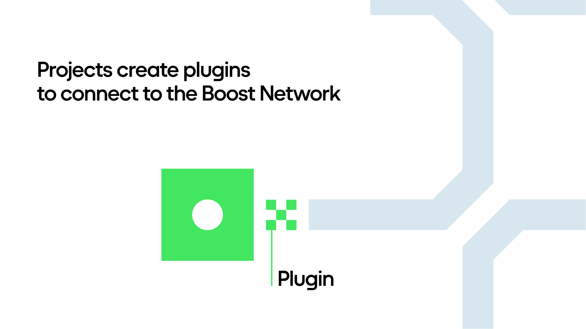

# Introduction

### **What Are Boost Plugins**

Boost Plugins enable seamless translation of transaction data into standardized actions. The goal of Boost Plugins is to decode complex contract interactions into recognizable actions like swapping, bridging, or staking. Using this standardized action information we can then determine if a given user has made a transaction that meets the specific criteria for a particular boost.

For example, the Uniswap plugin transforms transaction data from [Uniswaps `execute` function](https://arbiscan.io/tx/0xfd288567b1a9c827a260b28ff0b6b183d256c60881f75c7d86d50a501593c6fd) into a standardized `swap` action, allowing boost creators to create targeted boosts with specific parameters, such as specific networks, amounts or even specific tokens that need to be traded in order to pass.&#x20;

Plugins live in the Boost [QuestDK-Plugin Repo](https://github.com/rabbitholegg/questdk-plugins) and can be developed from templates with a few simple steps. (More on this soon!)

There is support for many standard actions you will find in the Ethereum ecosystem. A few of the more common examples being `bridge`, `swap`, `mint` and `delegate`. A full list of supported actions can be found in the Boost [QuestDK-Plugin](https://github.com/rabbitholegg/questdk-plugins) Repo.

***

### **Why Boost Plugins?**

Every protocol uses different formats and standards to describe transactions, making it difficult for our systems to communicate, understand, and work with each other. That’s why building Boost Plugins is necessary to convert various transaction data into standardized and understandable formats that can be used on our platform.

<figure><figcaption>
Plugins connect your project into the Boost Network
</figcaption></figure>

Without a plugin, it’s not possible to create boosts for a specific action, since we don’t have the ability to parse the transaction data and understand the actions that are occurring in those transactions. **These plugins allow us to store action information in a standardized way.** Once the action has been standardized we can use any of these standard elements as criteria for boosts on the platform. As the protocol progresses and we roll out more features, this also unlocks the ability to perform advanced analytics on a given class of actions.

In the Uniswap example below, you will see a very specialized pattern for their Swap contract:

<figure><figcaption>
Uniswaps Execute Function. Boost Plugins decode this input data into standard parameters, such as tokenIn, and amountIn, which can then be used as criteria for boosts.
</figcaption></figure>

Without a plugin to translate this information into a standardized format, it wouldn’t be possible to establish specific success criteria for boosts deployed through boost terminal. In this particular example, since all the inputs are encapsulated within a `bytes` array, deciphering these common attributes (amount, token, etc.) shared among all swaps becomes infeasible without the aid of our plugin.

Once a project has a plugin merged into our plugin repository, it will become available as an option on Boost Manager to deploy a boost for.
