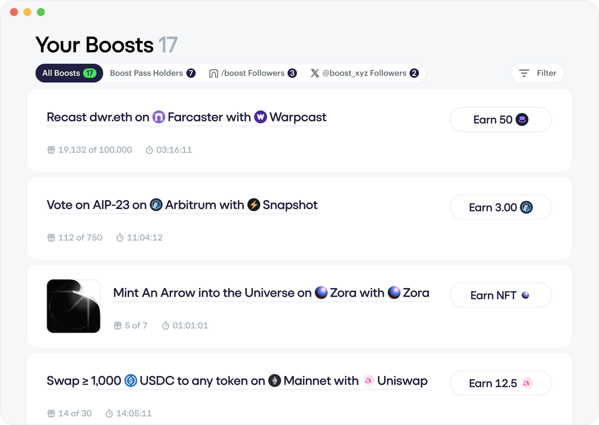
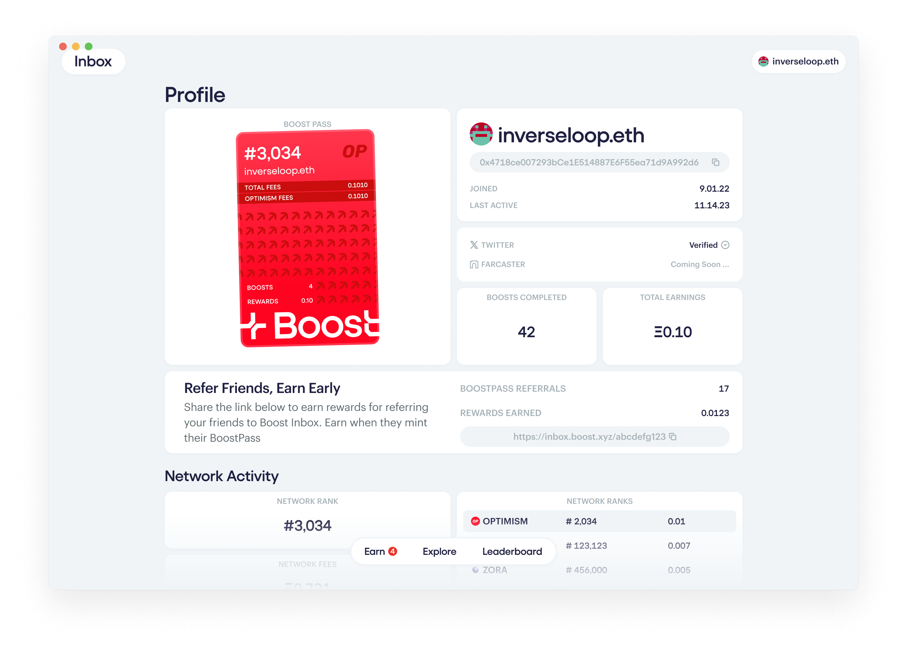

# Boost Inbox

Boost Inbox is the primary frontend client to perform onchain actions and earn token rewards. Built on Boost Protocol, it is just one of the many platforms that you can earn boosts on.



### How it works

Boosts are incentive offers to do things onchain. Deployed on Boost Protocol, anyone can target and incentivize you with token rewards based on the value of your onchain activity. To receive your offers, you can find them on Boost Inbox, the main interface to discover and receive public and targeted boosts. Just like how you receive offers in your email inbox to buy things online, Boost Inbox is where you receive incentive offers to do things onchain.

<figure><figcaption></figcaption></figure>

### Minting a Boost Pass

The Boost Pass is your personal ticket to higher rewards and ownership. It is a dynamic soulbound ERC-721 that gives early access to Boost Inbox, exclusive rewards, and voting rights on the Boost Treasury.&#x20;

When you mint a Boost Pass, you'll find that it's personalized to you based on your onchain activity. Discover your:

* **Rank:** Calculated based on the amount of gas fees you spent on each integrated network. Currently Optimism, Arbitrum and Base.
* **A Team:** Which network you spent the most fees on.

<figure><figcaption></figcaption></figure>

This is important because it'll give you the following benefits:

* **Exclusive incentives offers:** Depending on your Boost Pass rank and team, you can become eligible for higher incentive offers.
* **Governance rights:** Boost Pass holders are granted voting rights in the Boost Guild, a coalition of community stakeholders that govern Boost Protocol's treasury spending.
* **Personalized onchain insight:** You get a detailed view of your wallet's onchain profile and history on the supported networks. See how active you are on each chain and how you rank against others.
* **Early access to Inbox:** As the full Boost Inbox platform rolls out in February 2024, Boost Pass holders will get early access.

### You can mint your Boost Pass now


