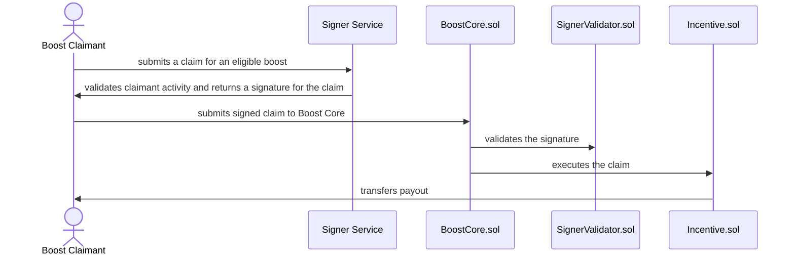

```mermaid
    sequenceDiagram
        actor claimant as Boost Claimant
        participant signer as Signer Service
        participant core as BoostCore.sol
        participant validator as SignerValidator.sol
        participant incentive as Incentive.sol
        claimant ->> signer: submits a claim for an eligible boost
        signer ->> claimant: validates claimant activity and returns a signature for the claim
        claimant ->> core: submits signed claim to Boost Core
        core ->> validator: validates the signature
        core ->> incentive: executes the claim
        incentive ->> claimant: transfers payout
```

