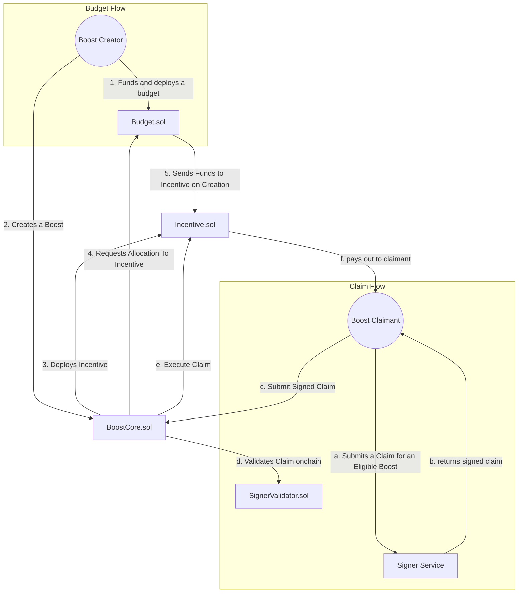

```mermaid
  flowchart TB
    subgraph Budget Flow
        direction TB
        creator
        Budget
    end

    subgraph Claim Flow
        direction TB
            claimant
            signer
            validator
    end
    creator((Boost Creator)) -->|1. Funds and deploys a budget| Budget[Budget.sol]
    creator -->|2. Creates a Boost| Core
    Core[BoostCore.sol] ---->|3. Deploys Incentive| Incentive[Incentive.sol]
    Core -->|4. Requests Allocation To Incentive| Budget
    Budget --->|5. Sends Funds to Incentive on Creation| Incentive

    claimant((Boost Claimant)) ------>|a. Submits a Claim for an Eligible Boost| signer[Signer Service]
    signer --->|b. returns signed claim| claimant
    claimant ---> |c. Submit Signed Claim| Core 
    Core --> |d. Validates Claim onchain| validator[SignerValidator.sol]
    Core -->|e. Execute Claim| Incentive
    Incentive -->|f. pays out to claimant| claimant
            
```
