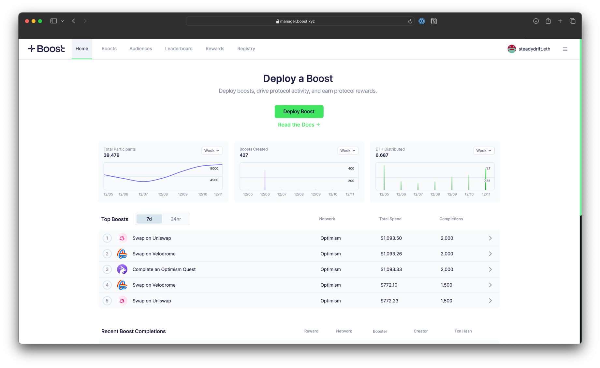

# How to Deploy a Boost

The Boost Manager app is the main interface for[^1]anyone to deploy, manage and track boosts. Within minutes, you can boost a variety of onchain activity, such as token swapping, deposits into liquidity pools, staking, delegating governance tokens, minting NFTs, or bridging assets across chains.

There are 3 main parts to the deploy a boost:

1. **Set your goal and target:** Configure the smart contract parameters with the onchain action you'd like incentivize.
2. **Select your target allowlist:** Upload a CSV or choose from a list of preset audiences to create a custom-targeted allowlist.
3. **Deposit and deploy instantly**: Deposit as little a cent and only pay for results.

Start by connecting your wallet to the Boost Manager app.&#x20;



<figure><figcaption></figcaption></figure>

[^1]: 
