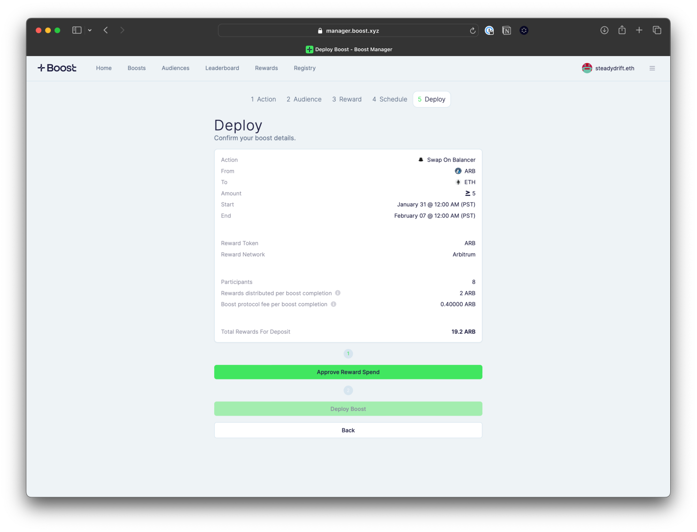

# Deploy the Smart Contract

Review all the boost details to ensure the require action, target audience and reward amount is correct. To deploy the boost, you will need to deposit the total reward funds into the smart contract, plus the [Protocol Fee](../../protocol-concepts/protocol-fees.md). Deploying a boost requires two contract interactions: an approval of tokens and boost deployment.&#x20;


Note that if you close your window, you will need to start the boost creation flow over again.


Once the boost has been deployed, you will be directed to a link to view the boost details where performance data is updated in real-time.

<figure><figcaption></figcaption></figure>
