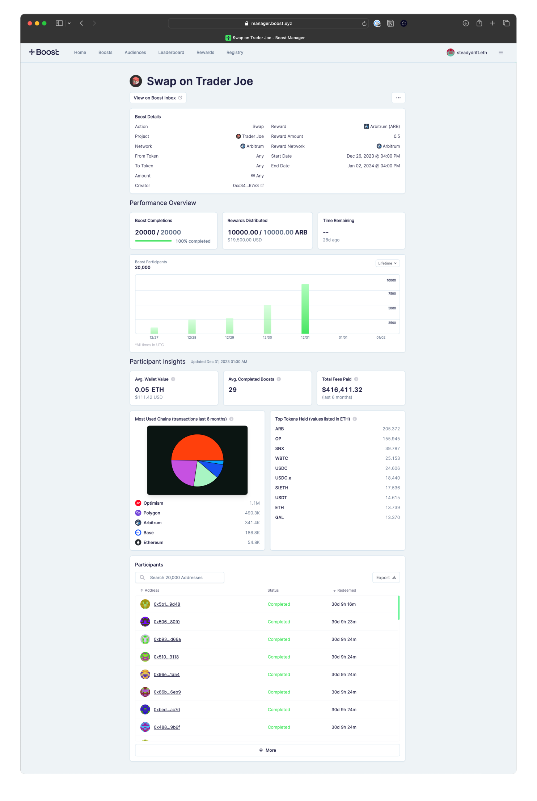

# Monitor a Boost

Anyone can see all the active, expired and upcoming boosts under the “Boost” tab in the navigation bar. You can click into any boost to view its detailed description and the performance and user insights:

* **Performance insights:** shows the total number of users that completed the boost transaction and total rewards distributed.
* **User insights:** shows details of the users that completed the boost, like the hourly/daily breakdown of completions, top protocols used, average wallet balance in ETH, and other transaction history.

<figure><figcaption></figcaption></figure>
