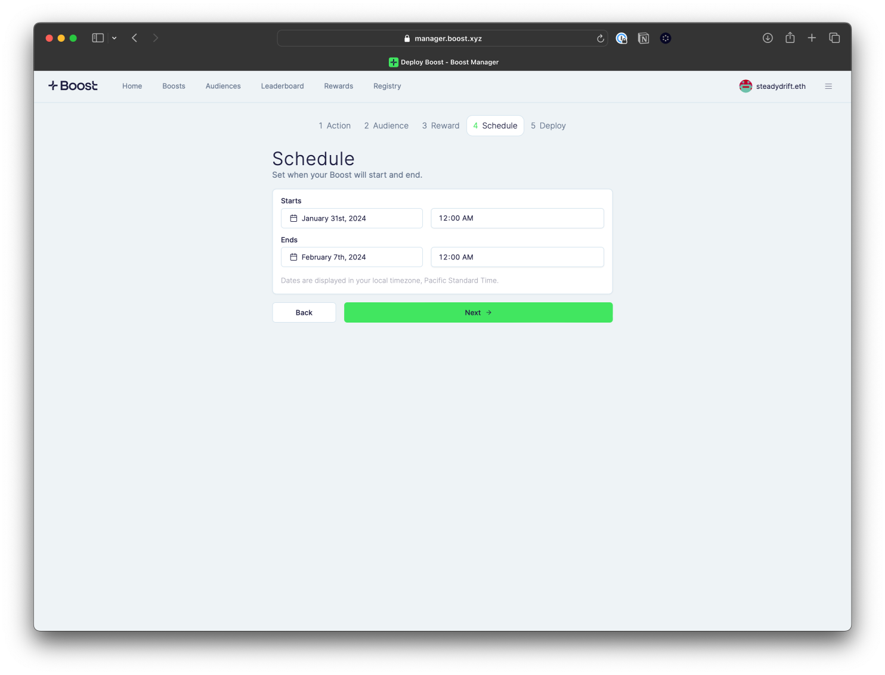

# Schedule the Boost

You can choose to deploy a boost immediately or you can schedule it at an exact time or date in the future. A boost can be active for a maximum of 30 days. Dates are displayed in your local timezone.

<figure><figcaption></figcaption></figure>
