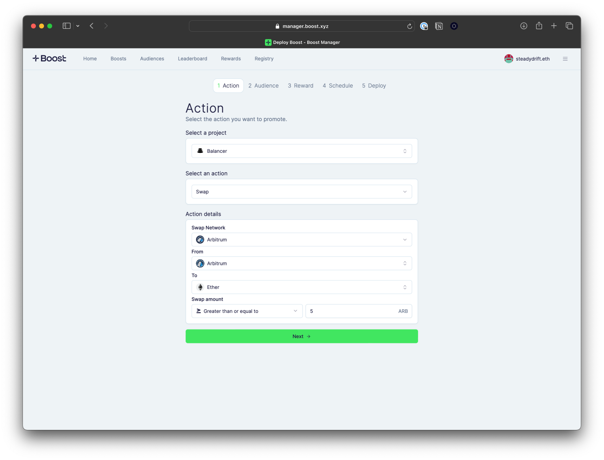

# Select an Action

To create a boost, you must first select the project you want to issue a boost for and the onchain action you’d like to incentivize.

Boost Protocol currently supports creating boosts for 60+ projects. For the full list of supported projects and action types, [view the Boost Registry page](https://manager.boost.xyz/registry). New projects are added weekly by the Boost Studios team, but anyone can also build their own Boost Plugin to register their smart contracts to the protocol. Learn more about [how build a Boost Plugin](../../for-developers/boost-sdk-plugins/).

<figure><figcaption>
When deploying your boost, you have the option to set specific parameters, like amounts.
</figcaption></figure>

Once the project is selected, you can select the available action type(s) associated to the project. Boost Protocol currently supports the following onchain actions: swap, deposit, stake, delegate, mint, open a position and bridge.

To add an existing action type to a project, view the documentation for [building a plugin](../../for-developers/boost-sdk-plugins/). To request a completely new action that is not currently available on Boost Protocol, please [fill out this form](https://airtable.com/appkNrxZJM6bGsQa9/shrLVU8kSFnJPLjNn).


When selecting the action type, consider your goals for deploying boosts. If it’s to acquire new users, you’ll want to choose an easier action (i.e. swapping a token that users often have instead of a less popular token). The higher the bar to accomplish the action, the narrower the group of users it’ll attract.

Certain action types are set up to give you the ability to further define the action criteria. For instance, you can require the end user to spend a minimum amount or use a specific token or network. Providing more transaction details will help align boosts closer to your goals.

