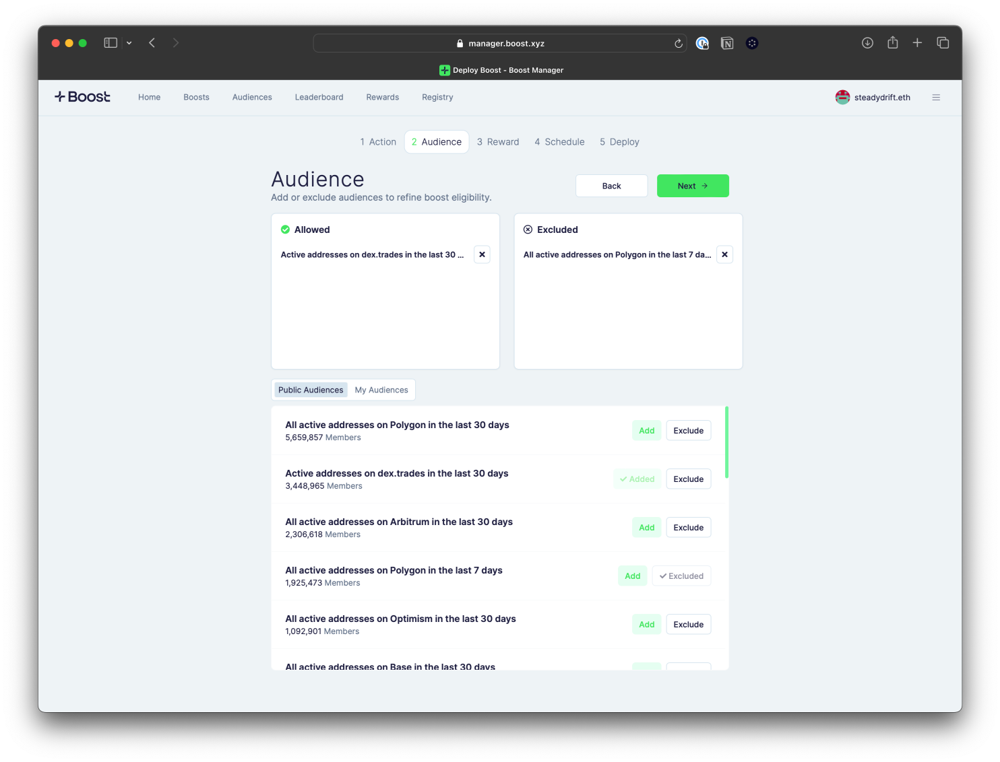
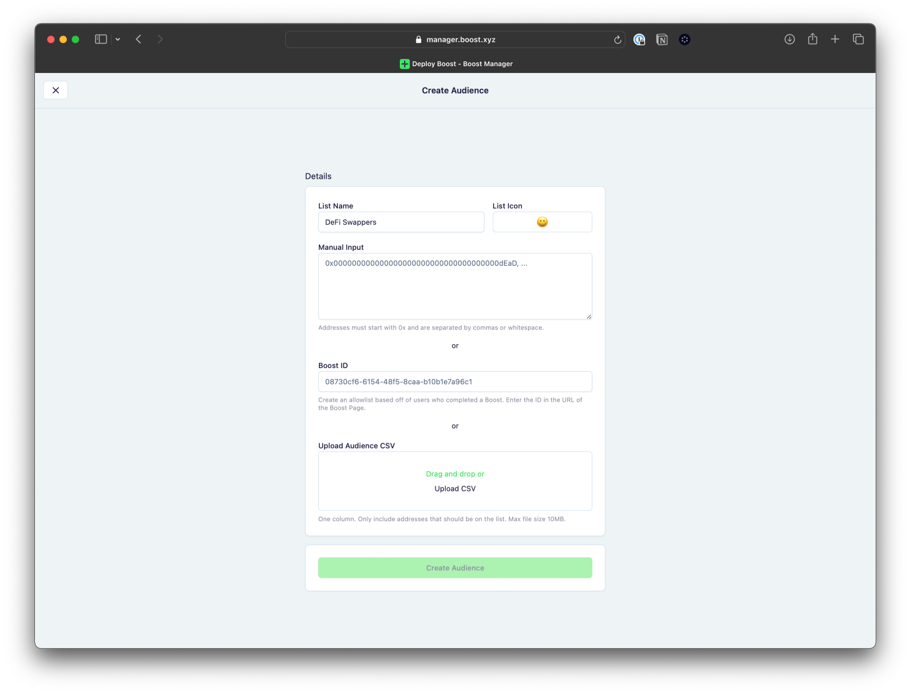
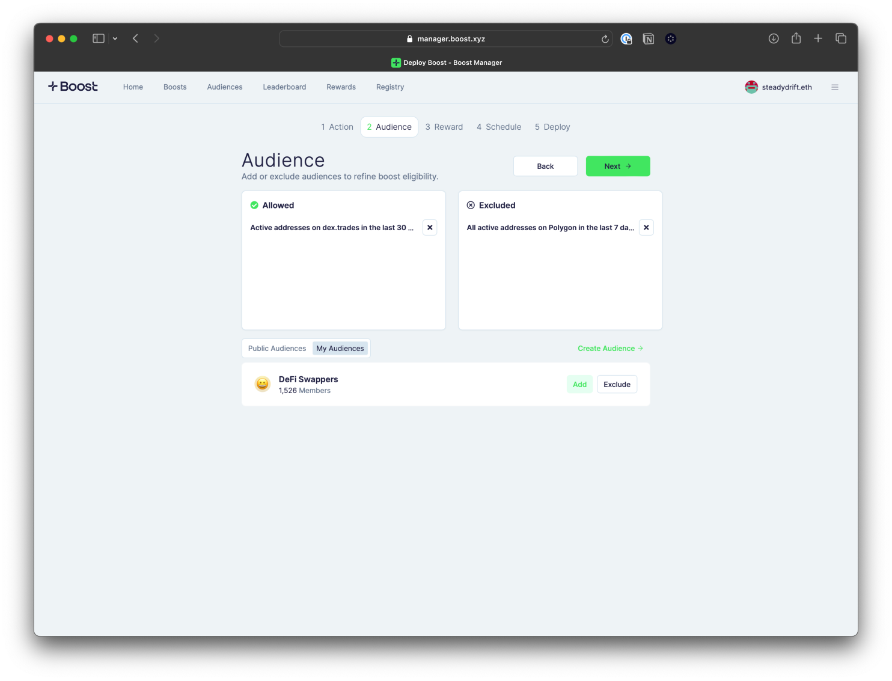

# Select an Audience

Choosing the right target users is one of the most important steps to achieve your goals. Boost Manager comes with a variety of preset audience lists that you can select from. Easily choose who should be eligible to receive the boost incentive and who should be excluded. You can also upload your own list of wallet addresses to create custom audience lists.

<figure><figcaption></figcaption></figure>


Selecting no audiences will default the boost to public, meaning any wallet address will be eligible to receive the boost. It is highly recommended to select an audience to protect from sybil and farmers.


### **Create Your Own Audience**

To upload your own custom audience, navigate to the “Audiences” tab. You have three options to create your audience:

1. **Manual input:** Copy and paste the list of wallet addresses into the text box. Addresses must start with 0x (no ENS) and are separated by commas or whitespace.
2. **Paste existing Boost ID:** Pull wallet address data from a previously deployed boost. This can be your own boost, a competitor’s boost or boost that targets a similar audience as you. Find the Boost ID in the details page of the boost you’d like to pull user data from and input the information.
3. **Upload a CSV file:** Upload a .csv file with one column listing all the wallet addresses. Addresses must start with 0x (no ENS).

<figure><figcaption></figcaption></figure>

Once the custom audience is created, you can find the list saved and always available to you when selecting an audience during boost creation. Find the custom audience under the ‘My Audiences’ tab and add or exclude as needed.

<figure><figcaption></figcaption></figure>
