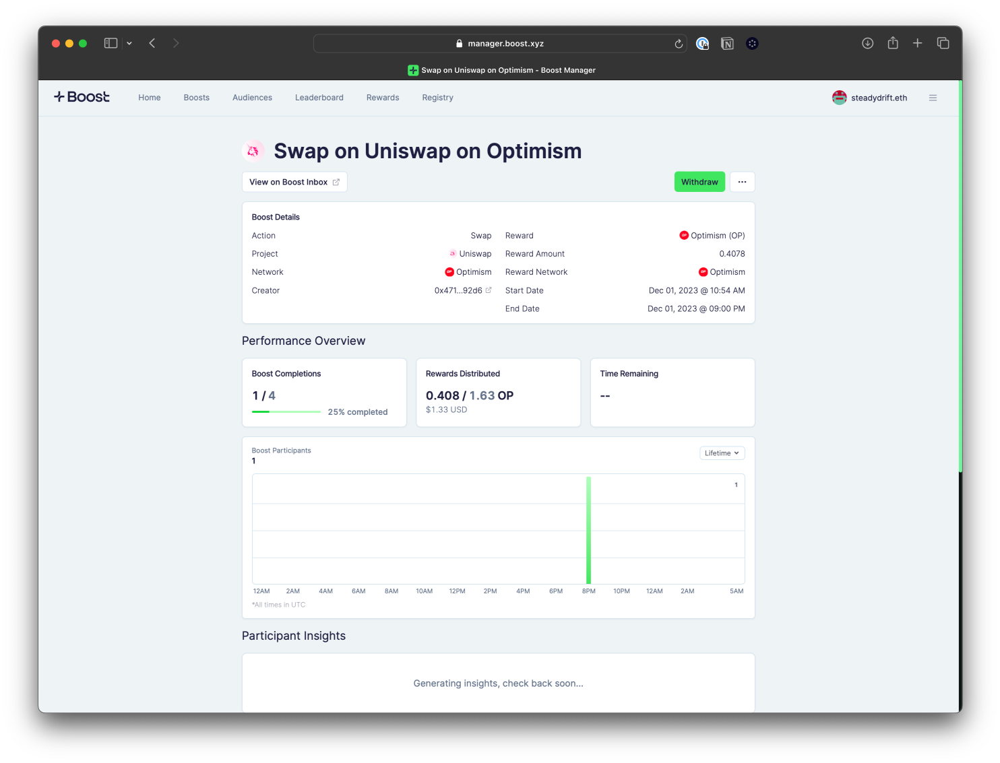
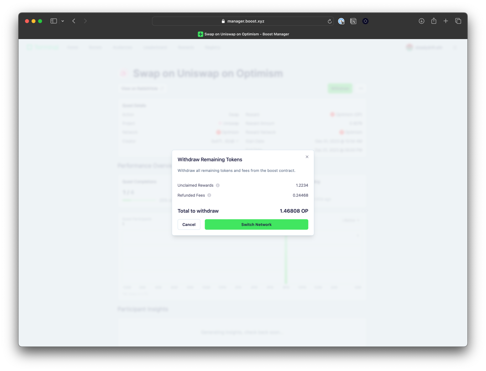

# Withdrawing Funds

A key benefit of Boost is that you only pay for results. If you deployed a boost and there are still remaining funds left after it has expired, you can easily withdraw the tokens. Head to the details page of the boost you deployed and on the top left, you will see an option to “Withdraw”.

<figure><figcaption></figcaption></figure>

Once clicking Withdraw, a confirmation will appear showing the breakdown of how many tokens you will receive for withdrawing. Alternatively, you can also choose to keep these leftover funds on the platform to be used for the next boost you deploy.

<figure><figcaption></figcaption></figure>
